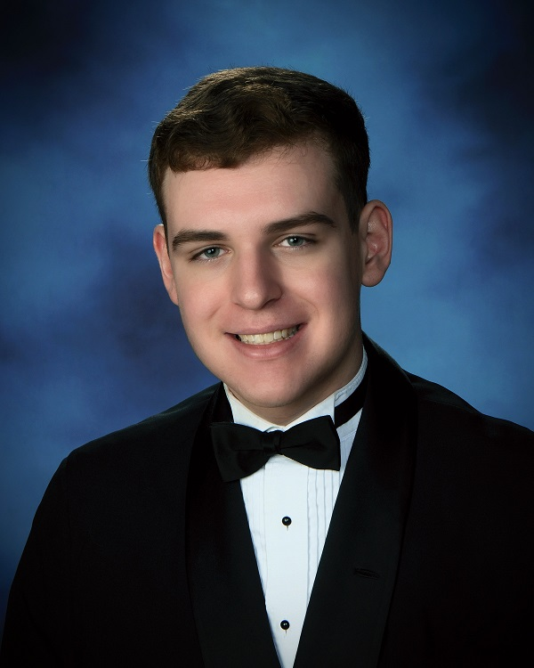

# About

## Introduction

My name is Matthew Merritt, and I am currently a first-year student at Quinnipiac University. I am pursuing the Bachelor of Science in Computer Science as well as a minor in Game Design and Development.

## Education

I began to learn basic programming in Python when I was in the eighth grade, using it to create simple graphical applications and a few small games. I went on to St. Vincent Pallotti High School in Maryland, where I actively sought out opportunities to continue learning about Computer Science. I was a captain and lead programmer of the newly founded FTC robotics team, Pallotti Robotics #12342, for all four years of my high school career. I also took both of the AP Computer Science courses offered by the school, scoring a 5 on each exam. I graduated as the co-valedictorian, having been tied with my brother, Michael Merritt. I am now continuing my education at Quinnipiac University in Connecticut.

## Computer Science Background

Throughout my years of programming, I have primarily worked in Python and Java, athough I have also worked with JavaScript, Scala, and C#. During my high school career, I worked with Java for both my classes and the robotics team, allowing me to gain a lot of experience with the language. I have also been exposed to a variety of tools used in Computer Science such as Elastic, Splunk, AWS, Git, and GitHub. I have participated in two internships with the Maryland Innovation & Security Institute at DreamPort, where I was able to learn about cybersecurity and machine learning with neural networks. I was also able get hands-on experience working with tools like Elastic, Splunk, and AWS, and I was able to meet with experts in cybersecurity.

## Interests

My interests primarily involve the growing field of technology, namely programming. To explore my interest in programming, I worked with robotics throughout high school and have recently begun to work with designing video games. I am a member of the Quinnipiac Computing Club, where I have participated in Coding Jeopardy and the hackathon, and I am also a member of the Quinnipiac Game Developers Club, where I participated in the club's first game jam.

[Return to home page](./)